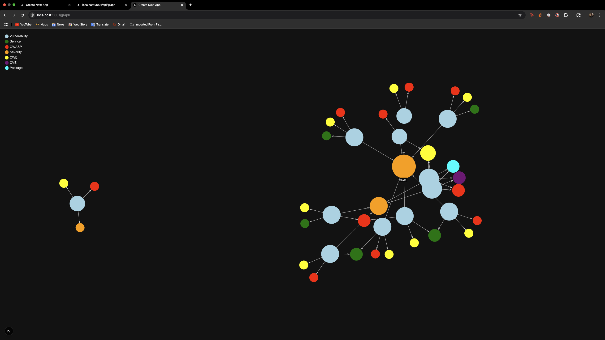
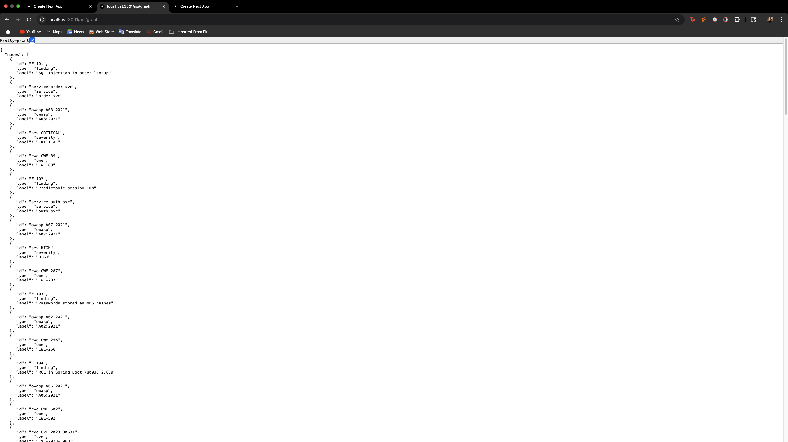
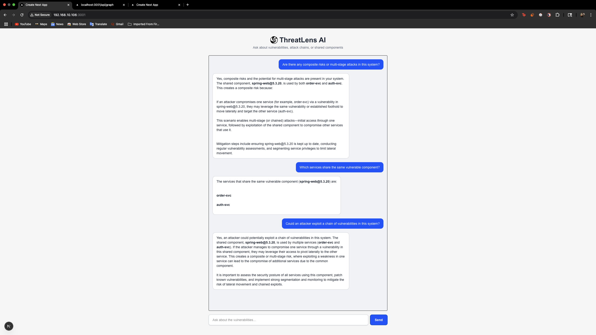
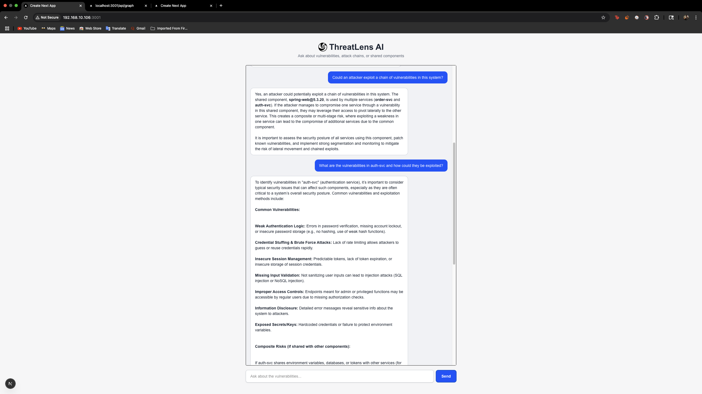

# ThreatLens AI – MindFort Technical Take-Home Submission

Welcome to **ThreatLens AI**, an autonomous system designed to visualize and reason over vulnerabilities using a **Vulnerability Knowledge Graph** and **Multi-Agent Chat System**. Built with Next.js, TypeScript, Litellm, and `react-force-graph-2d`, the solution offers both analytical insight and intuitive UX.

 **Live Deployment**:
**Main app**: [https://threatlensai.vercel.app/](https://threatlensai.vercel.app/)
**Knowledge graph**: [https://threatlensai.vercel.app/graph](https://threatlensai.vercel.app/graph)
**Graph API JSON**: [https://threatlensai.vercel.app/api/graph](https://threatlensai.vercel.app/api/graph)

---

## Project Objective

> Build a full-stack **Vulnerability Knowledge Graph & Multi-Agent Reasoning Chat System** that can ingest security findings, form relational insights between entities, and allow users to query risks or attack paths in natural language.

---

##  Features

### Vulnerability Knowledge Graph (`/graph`)

* Graph visualization of findings using:

  * Nodes for entities: Vulnerability, OWASP, CVE, CWE, Severity, Services, Packages
  * Edges for relationships: Shared libraries, cause-effect links, co-occurrence
* Severity-based node sizing (Critical > High > Medium > Low)
* Color-coded nodes by entity type
* Interactive zoom and labels



---

###  RESTful Graph API (`/api/graph`)

* Returns nodes and edges from ingested findings
* Pre-processed to include:

  * Severity
  * Degree centrality
  * Explicit and inferred relationships



---

### Multi-Agent Reasoning Chat Interface (`/`)

* Users can ask questions like:

  * “Are there any composite risks?”
  * “Which services share components?”
  * “Could an attacker chain vulnerabilities?”
* Behind the scenes:

  * Prompts are routed to agents (via Litellm) simulating multi-perspective reasoning
  * Responses contain explanatory insight, not just answers




---

## Tech Stack

| Layer         | Technology                                                               |
| ------------- | ------------------------------------------------------------------------ |
| Frontend      | Next.js (App Router), Tailwind CSS                                       |
| Visualization | `react-force-graph-2d`                                                   |
| Backend       | TypeScript API Routes                                                    |
| LLM Routing   | [LiteLLM](https://docs.litellm.ai/docs/) – GPT-4.1, o4-mini, Grok-3-mini |
| Deployment    | Vercel                                                                   |
| Data Source   | Findings JSON (provided in assignment)                                   |

---

## Knowledge Graph Schema

Entities (`nodes`):

* `finding`, `OWASP`, `severity`, `CWE`, `CVE`, `service`, `package`

Relationships (`edges`):

* `finding -> CWE`
* `finding -> service`
* `service -> package`
* `finding -> severity`
* `CWE -> CVE`
* Inferred: shared vulnerable libraries, misconfig lineage

Node sizes vary by severity:

* Critical: largest
* High, Medium, Low: scaled down

---

## Project Structure

```
mindfort-assignment/
├── .next/                      # Next.js build output
├── images/                     # Screenshots
├── node_modules/
├── public/                     # Static assets
├── src/
│   ├── app/
│   │   ├── api/
│   │   │   ├── chat/           # API route for chat agent
│   │   │   └── graph/          # API route for graph data
│   │   ├── graph/              # Force-directed graph page
│   │   └── page.tsx            # Home page with chat UI
│   └── lib/
│       ├── enrichment.ts       # Data enrichment logic
│       ├── findings.ts         # Parsed JSON data
│       └── types.ts            # Shared types
├── .gitignore
├── eslint.config.mjs
├── next.config.mjs
├── package.json
├── tsconfig.json
├── postcss.config.js
├── tailwind.config.ts
└── README.md                   # This file
```

---

## Reasoning Capability

The system identifies **composite risks** automatically. For example:

> “spring-web\@5.3.20 is used by both `order-svc` and `auth-svc`. If one service is compromised, it can lead to lateral movement into the other.”

This type of multi-stage inference is powered by simple graph traversals and LLM-assisted rules in the agent prompt.

---

## Deployment Notes

* Hosted on Vercel (fully SSR-compliant)
* `react-force-graph-2d` is dynamically imported to avoid `window is not defined` errors
* Works across browsers and devices

---

## Environment Variables (sample)

```bash
LITELLM_API_KEY=sk-...
LITELLM_BASE_URL=https://...
```

These are securely stored in Vercel's dashboard and not hardcoded.

---

## Getting Started Locally

```bash
git clone https://github.com/yourusername/mindfort-assignment
cd mindfort-assignment
npm install
cp .env.example .env.local
# add your Litellm credentials

npm run dev
```

Then visit [localhost:3000](http://localhost:3000)

---

## Improvements & Next Steps

* Add editable graph interface to simulate changes
* Add export as PDF or report
* Extend agent memory for multi-turn reasoning
* Integrate Neo4j if scale increases
* RAG + semantic memory for findings ingestion

---

## Submission Instructions

* ✅ Code hosted on GitHub
* ✅ Deployed on Vercel: [https://threatlensai.vercel.app/](https://threatlensai.vercel.app/)
* ✅ All routes functional: `/`, `/graph`, `/api/graph`
* ✅ Screenshots and README included

---

## Author

Built with ❤️ by Shubham Vyas
[GitHub](https://github.com/shhubhxm) • [LinkedIn](https://www.linkedin.com/in/shubham-vyas-2594a2152/)

---